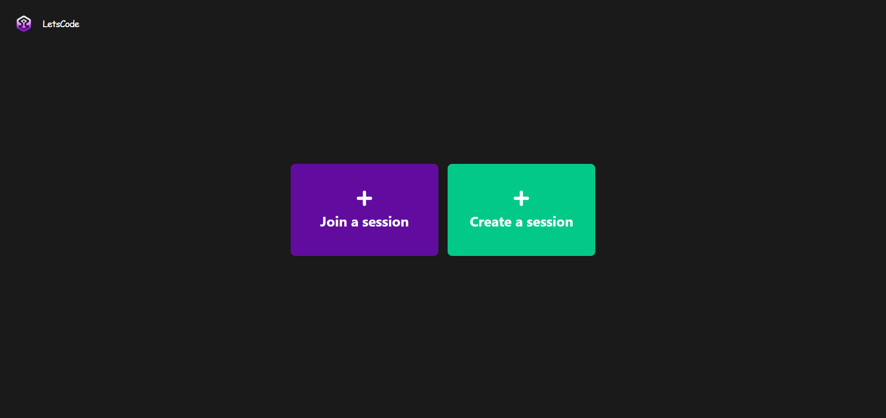

<div align="center">
  
</div>
<h1 align="center">
  LetsCode Online Compiler
</h1>



#### A simple online compiler that allows you to write and compile/execute code. The initial intent of this project was to create an online compiler that allows teachers to create a session (they can upload a pdf file) for exams instead of writing on a paper, students will have to join a session with the session id generated by the teacher when creating the session and thier full name, after a successful connection they will be directed to the main page, just like in the image below :point_down:, they would be automatically disconnected if thier mouse leaves the page or if they change the window, (there is toast when you try to leave the page to warn you)


## 🛠 Installation & Set Up

1. Download the repo :up:

   
   >[click here](https://github.com/AbassHammed/FrontendOnlineCompiler)
   

2. Install and use the correct version of Node using [NVM](https://github.com/nvm-sh/nvm)

   ```sh
   nvm install
   ```

3. Install dependencies from the directory path

   ```sh
   npm install
   ```

4. Start the development server

   ```sh
   npm run dev
   ```

## 🚀 Building and Running for Production

1. Generate a full static production build

   ```sh
   npm run build
   ```

1. Preview the site as it will appear once deployed

   ```sh
   npm run start
   ```